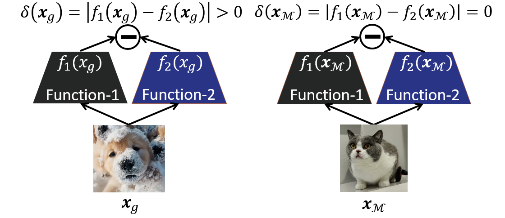

<div align="center">

<h1>Detecting Generated Images by Fitting Natural Image Distributions</h1>
<h3>A Distribution-Based Approach for AI-Generated Image Detection</h3>

[](https://www.python.org/downloads/)
[](https://pytorch.org/)
[](https://opensource.org/licenses/MIT)

<div align="center">
    <figure>
        <br>
        <p><em>A distribution-based framework for detecting AI-generated images by modeling natural image distributions in feature space</em></p>
    </figure>
</div>

</div>

## Abstract

This repository contains the official implementation of **Consistency Verification (ConV)**, a novel framework for detecting generated images that exploits geometric differences between the data manifolds of natural and generated images. Unlike existing methods that rely heavily on training binary classifiers with numerous generated images, ConV depends solely on fitting the natural image distribution. The framework employs a pair of functions engineered to yield consistent outputs for natural images but divergent outputs for generated ones, leveraging the property that their gradients reside in mutually orthogonal subspaces. This design enables a training-free detection method: an image is identified as generated if a transformation along its data manifold induces a significant change in the loss value of a self-supervised model pre-trained on natural images. To address diminishing manifold disparities in advanced generative models, we leverage Normalizing Flow models to amplify detectable differences by extruding generated images away from the natural image manifold.

## Motivation

The rapid advancement of generative AI technologies has led to increasingly sophisticated deepfakes and AI-generated images, posing significant challenges to image authenticity verification. Traditional detection methods often rely on model-specific artifacts, limiting their generalization capability when encountering novel generative models.

<div align="center">
    <figure>
        
        <br>
        <p><em>Architecture of the distribution-based detection framework</em></p>
    </figure>
</div>

Current limitations in generated image detection include:

- **Heavy Dependence on Generated Image Distribution**: Existing binary classification approaches require extensive collections of natural and generated images for training, making their performance heavily dependent on the diversity of generated data. This raises a fundamental question: can a detector trained on images from some generative models generalize to those from unknown models?

- **Generalization Challenges**: It is challenging to determine whether a binary classifier trained over images generated by certain diffusion models can generalize effectively to those generated by other models, limiting practical applicability

- **Computational Intensity**: Sustaining robust detection performance necessitates continual collection of images generated by the latest generative models, which can be costly or infeasible due to inaccessibility of potential models

- **Distribution Mismatch**: The performance of binary classifiers relies on the diversity of generated data, yet it remains uncertain whether they can effectively distinguish images from unknown generative models

### Our Approach

We propose **Consistency Verification (ConV)**, a novel framework that detects generated images by exploiting geometric differences between the data manifolds of natural and generated images. Unlike existing methods that rely heavily on the distribution of generated images, our approach depends solely on fitting the natural image distribution, enabling robust generalization to unknown generative models.

- **Manifold Disparity Exploitation**: The method leverages the fundamental observation that natural and generated images occupy distinct manifolds in the feature space. By visualizing feature representations extracted from DINOv2 (pre-trained solely on natural images), we observe that generated images exhibit distinct manifold structures compared to natural images, providing a geometric basis for detection.

- **Orthogonality Principle and Consistency Verification**: We introduce a pair of functions designed to yield consistent outputs for natural images but divergent outputs for generated ones. The design is guided by an orthogonality principle: the gradients of these functions lie in mutually orthogonal subspaces. This enables a **training-free detection approach**: an image is identified as generated if a transformation along its data manifold induces a significant change in the loss value of a self-supervised model pre-trained on natural images.

- **Normalizing Flow for Manifold Extrusion**: To address diminishing manifold disparities in advanced generative models, we employ Normalizing Flow models to explicitly extrude generated images away from the natural image manifold. By transforming the natural image manifold into a Gaussian distribution, the flow model enables precise separation and amplification of detectable differences between natural and generated images.

- **Natural Distribution Dependency**: A key advantage of ConV is its reliance on fitting the natural data distribution rather than the distribution of generated images. This design principle addresses the generalization challenge faced by binary classifiers, whose performance typically depends on the diversity of generated data, making them vulnerable to unknown generative models.
  
## Installation

### Requirements

- Python 3.8 or higher
- PyTorch 1.9 or higher
- CUDA (recommended for GPU acceleration)

### Dependencies

Install the required dependencies:

```bash
pip install -r requirements.txt
```

Core dependencies include:
- `torch>=1.9.0`
- `torchvision>=0.10.0`
- `numpy>=1.21.0`
- `scikit-learn>=0.24.0`
- `Pillow>=8.0.0`

### Development Setup

For development or customization:

```bash
# Clone the repository
git clone https://github.com/yourusername/ConV.git
cd ConV

# Create conda environment (optional)
conda create -n conv python=3.8
conda activate conv

# Install dependencies
pip install -r requirements.txt
```

## Usage

### Quick Start

#### Basic Detection 

The simplest approach compares DINOv2 feature similarities between original and augmented images:

```bash
python main.py \
  --real_path /path/to/real/images \
  --fake_path /path/to/fake/images \
  --max_sample 1000 \
  --batch_size 64 \
  --num_workers 2 \
  --crops_num 5 \
  --aggregation mean
```

**Parameters:**
- `--real_path` (required): Path to directory containing real images
- `--fake_path` (required): Path to directory containing generated images
- `--max_sample` (default: 1000): Maximum number of samples per class (0 for random sampling of 1000 images)
- `--batch_size` (default: 64): Batch size for processing
- `--num_workers` (default: 2): Number of data loading threads
- `--crops_num` (default: 5): Number of image crops for multi-view consistency analysis
- `--threshold` (default: 0): Classification threshold (0 for automatic threshold selection)
- `--aggregation` (default: 'mean'): Distance aggregation method (`mean`, `max`, or `min`)

#### F-ConV Method (Flow-based Convolutional)

Detection using Normalizing Flow models to shape natural image distributions.


**Training + Inference:**

```bash
python F-ConV.py \
  --real_path /path/to/test/real/images \
  --fake_path /path/to/test/fake/images \
  --train_real_path /path/to/train/real/images \
  --train_fake_path /path/to/train/fake/images \
  --path_mode separate \
  --data_mode ours \
  --max_sample 0 \
  --train_max_sample 0 \
  --batch_size 256 \
  --max_epoch 1 \
  --lr 1e-5 \
  --crops_num 1 \
  --model_path /path/to/save/model.pth
```

**Subdirectory Mode (for datasets with 0_real/1_fake structure):**

```bash
python F-ConV.py \
  --real_path /path/to/dataset/root \
  --path_mode subdirs \
  --data_mode ours \
  --max_sample 0 \
  --batch_size 256 \
  --crops_num 1 \
  --model_path /path/to/model.pth \
  --load_model
```

**F-ConV Parameters:**
- `--real_path` (required): Path to real images or root path for subdirs mode
- `--fake_path` (optional): Path to fake images (not needed for subdirs mode)
- `--data_mode` (default: 'ours'): Data mode (`wang2020` or `ours`)
- `--path_mode` (default: 'separate'): Path mode (`separate` for separate real/fake paths, `subdirs` for 0_real/1_fake structure)
- `--max_sample` (default: 0): Maximum samples per class for testing (0 for all)
- `--batch_size` (default: 256): Batch size
- `--num_workers` (default: 4): Number of data loading threads
- `--max_epoch` (default: 1): Number of training epochs
- `--lr` (default: 1e-5): Learning rate
- `--crops_num` (default: 1): Number of crops
- `--train_real_path` (optional): Training real image path
- `--train_fake_path` (optional): Training fake image path
- `--train_path_mode` (default: 'separate'): Training path mode
- `--train_max_sample` (default: 0): Maximum samples per class for training (0 for all)
- `--model_path` (optional): Path to save/load model weights
- `--load_model` (flag): Load model from model_path instead of training

#### Feature Extraction Mode

For large-scale datasets, features can be pre-extracted for efficient training:

**Extract Features:**

```bash
python extract_features.py \
  --real_path /path/to/real/images \
  --fake_path /path/to/fake/images \
  --path_mode separate \
  --data_mode ours \
  --max_sample 0 \
  --output_path features.pkl \
  --batch_size 64 \
  --num_workers 4
```

**Training with Pre-extracted Features:**

```bash
python F-ConV-feature.py \
  --real_path /path/to/test/real/images \
  --fake_path /path/to/test/fake/images \
  --train_feature_path features.pkl \
  --path_mode separate \
  --data_mode ours \
  --max_sample 0 \
  --batch_size 256 \
  --max_epoch 1 \
  --lr 1e-5 \
  --model_path /path/to/save/model.pth
```

**F-ConV-feature Additional Parameters:**
- `--train_feature_path`: Path to pre-extracted feature pickle file
- `--val_real_path` (optional): Real image path for validation during training
- `--val_fake_path` (optional): Fake image path for validation during training
- `--val_path_mode` (default: 'separate'): Validation path mode
- `--val_max_sample` (default: 1000): Maximum samples per class for validation
- `--margin` (default: 2000): Margin parameter for loss function
- `--temperature` (optional): Temperature parameter for sigmoid in testing

### Batch Evaluation

Evaluate on multiple datasets using the provided script:

```bash
bash run_all_datasets.sh
```

This script automatically iterates through configured dataset paths and aggregates results.

## Configuration

### Model Configuration (config.py)

Key configuration parameters:

```python
n_coupling_blocks = 2    # Number of coupling blocks in Flow model
fc_internal = 4096        # Hidden units in fully connected layers
```

### Data Format

The project supports multiple data organization formats:

1. **Separate Mode** (`--path_mode separate`): Separate directories for real and generated images
   ```
   dataset/
   ├── real/     # Real images
   └── fake/     # Generated images
   ```
   Usage: `--real_path /path/to/real --fake_path /path/to/fake --path_mode separate`

2. **Subdirectory Mode** (`--path_mode subdirs`): Single root directory with subdirectories containing `0_real` and `1_fake` folders
   ```
   dataset/
   ├── subset1/
   │   ├── 0_real/  # Real images
   │   └── 1_fake/  # Generated images
   ├── subset2/
   │   ├── 0_real/
   │   └── 1_fake/
   └── ...
   ```
   Usage: `--real_path /path/to/dataset/root --path_mode subdirs`


4. **Supported Image Formats**: PNG, JPG, JPEG

## Evaluation Metrics

The following evaluation metrics are provided:

- **AUROC** (Area Under ROC Curve): Area under the receiver operating characteristic curve, measuring classification performance
- **FPR@95%TPR**: False positive rate at 95% true positive rate
- **Accuracy**: Classification accuracy based on optimal threshold selection

Example output:
```
AUROC: 0.9523
AP: 0.9456
ACC: 0.9234
```

## Methodology

### Core Principle

The ConV framework exploits geometric differences between the data manifolds of natural and generated images. The core principle is based on the observation that natural and generated images occupy distinct manifolds in the feature space, as visualized through DINOv2 embeddings. Our method leverages this manifold disparity through:

1. **Manifold Disparity Observation**: Feature representations extracted by DINOv2 (pre-trained solely on natural images) reveal that generated images exhibit distinct manifold structures compared to natural images

2. **Orthogonality Principle**: We design a pair of functions whose gradients lie in mutually orthogonal subspaces, ensuring consistent outputs for natural images but divergent outputs for generated ones

3. **Training-Free Detection**: An image is identified as generated if a transformation along its data manifold induces a significant change in the loss value of a self-supervised model pre-trained on natural images

4. **Manifold Extrusion with Normalizing Flow**: To amplify detectable differences, Normalizing Flow models are employed to explicitly extrude generated images away from the natural image manifold by transforming the natural manifold into a Gaussian distribution

### Technical Details

#### DINOv2 Feature Extraction

- Pre-trained DINOv2 ViT-L/14 model is employed
- Normalized feature vectors are extracted
- Multi-crop view feature extraction is supported

#### Normalizing Flow Model

- Reversible neural network based on flow architecture
- Feature distribution is learned through coupling layers

#### Loss Functions

The F-ConV method employs the following loss functions:

- **Shape Loss**: Distinguishes feature distributions between real and generated images
- **Consistency Loss**: Ensures feature consistency across transformations
- **Total Loss**: Combined loss for end-to-end training


### Performance

The method demonstrates superior detection performance across multiple datasets, particularly in cross-model generalization scenarios.

## Citation

If you find this work useful for your research, please cite:

```bibtex
@inproceedings{
  zhang2025detecting,
  title={Detecting Generated Images by Fitting Natural Image Distributions},
  author={Zhang, Yonggang and Nie, Jun and Tian, Xinmei and Gong, Mingming and Zhang, Kun and Han, Bo},
  booktitle={NeurIPS 2025},
  year={2025},
}
```


## File Structure

```
ConV/
├── main.py                 # Basic detection method (DINOv2 + cosine similarity)
├── F-ConV.py              # F-ConV method (Flow-based)
├── F-ConV-feature.py      # F-ConV with pre-extracted features
├── model.py               # Normalizing Flow model definition
├── config.py              # Configuration file
├── utils.py               # Utility functions and loss functions
├── augmentation.py        # Data augmentation (basic method)
├── augmentations_fconv.py # Data augmentation (F-ConV method)
├── extract_features.py    # Feature extraction script
├── extract_features.sh    # Feature extraction shell script
├── run_all_datasets.sh   # Batch evaluation script
├── requirements.txt       # Dependency list
└── README.md             # This file
```

## License

This project is licensed under the MIT License. See the LICENSE file for details.

## Contact

For questions, technical support, or collaboration inquiries, please contact nj18@mail.ustc.edu.cn.
